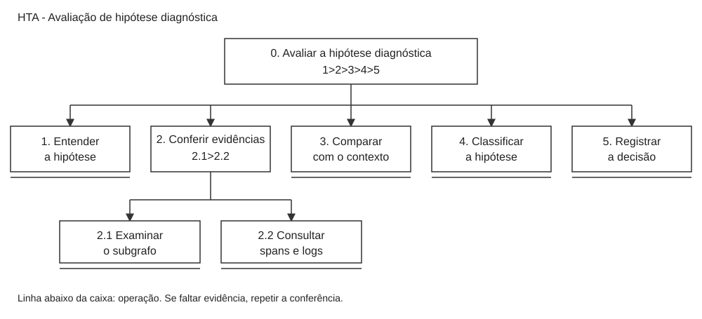
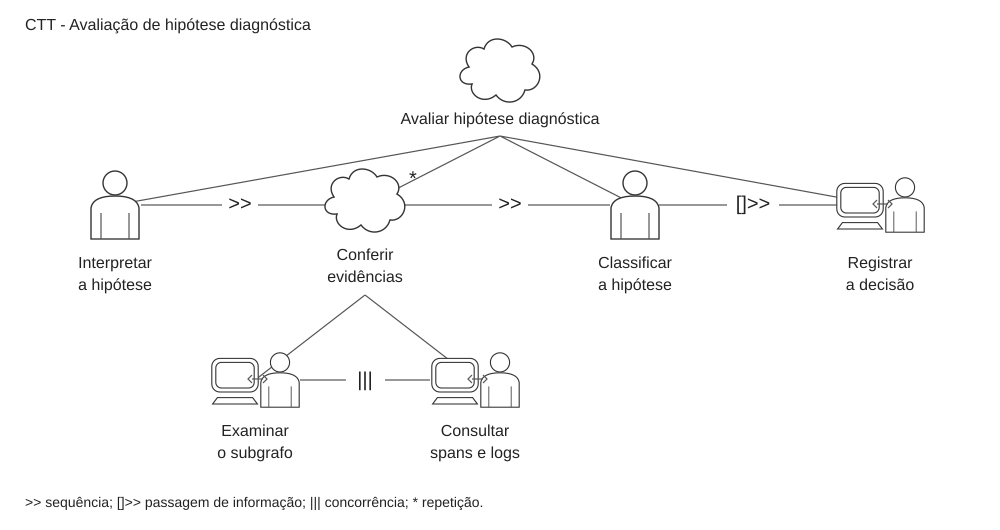

# Entrega 5 — Análise de tarefas: HTA, GOMS e CTT

**Data:** 17/09/2026

**Autor:** Gabriel Lovato — 22.123.004-8

**Responsabilidade:** cada integrante modela pelo menos 1 HTA, 1 GOMS e 1 CTT. As três técnicas podem abordar a mesma funcionalidade ou funcionalidades distintas, conforme a orientação da disciplina.

## Objetivo da atividade

Analisar como o usuário avalia uma hipótese sobre a causa de uma falha em um sistema distribuído. O HTA mostra a divisão da tarefa, o GOMS descreve maneiras de realizá-la e o CTT representa a relação entre as etapas.

## 1. Tarefa escolhida

| ID | Tarefa | Persona | Cenário relacionado | Autor |
|---|---|---|---|---|
| T01 | Avaliar uma hipótese diagnóstica e decidir se ela é sustentada pelas evidências | P01 — Lucas, desenvolvedor backend | C01 — Falha no checkout após um deploy | Gabriel Lovato |

O TCC utiliza um pipeline em dois estágios: primeiro seleciona evidências em um grafo de observabilidade e depois usa um modelo de linguagem (LLM) para gerar hipóteses sobre a falha. Escolhi avaliar essas hipóteses porque uma explicação pode parecer correta sem corresponder ao que aconteceu no sistema.

No cenário C01, Lucas precisa separar a falha inicial dos erros que surgiram nos outros serviços. A tarefa T01 aborda uma parte desse trabalho: conferir uma explicação recebida antes de usá-la para orientar uma correção. Ela também se relaciona com H03, da Entrega 1, sobre apresentar as hipóteses junto das evidências que as sustentam.

A tarefa começa com a hipótese e suas evidências disponíveis. Termina quando Lucas registra sua avaliação e o motivo da decisão. A geração da hipótese, o treinamento dos modelos e a implementação do pipeline não fazem parte da tarefa humana analisada aqui.

Esta é uma modelagem proposta para a interface da disciplina, baseada nas entregas anteriores. Não foi realizada uma observação de usuários para confirmar o fluxo. A frequência de uso e os critérios de avaliação ainda precisam ser investigados. A tarefa foi considerada crítica porque uma interpretação errada pode direcionar a correção ao serviço errado.

## 2. HTA — Avaliar uma hipótese diagnóstica

**Autor:** Gabriel Lovato — 22.123.004-8

### Descrição

Lucas lê a hipótese, confere os registros associados e compara a explicação com o contexto do incidente. Depois, decide se há suporte para a hipótese e registra uma justificativa. Se faltar informação, ele volta à conferência das evidências.

### Diagrama

*Figura 1 — HTA da avaliação de uma hipótese diagnóstica. Fonte: elaboração do autor, com notação baseada no material de aula.*

As caixas representam objetivos e operações. O plano dentro da caixa indica a ordem das etapas. A linha abaixo da caixa marca uma operação: neste modelo, a decomposição para nesse nível, embora a operação ainda possa envolver várias ações.

### Tabela detalhada

| ID | Objetivo/operação | Plano, entrada e retorno | Problema e recomendação |
|---|---|---|---|
| 0 | Avaliar a hipótese diagnóstica | **Plano:** 1 > 2 > 3 > 4 > 5. **Entrada:** hipótese e evidências do incidente. **Retorno:** avaliação registrada com justificativa. | O texto gerado pode passar uma certeza que os dados não sustentam. Manter clara a diferença entre hipótese e causa confirmada. |
| 1 | Entender a hipótese | Identificar a causa apontada, o serviço envolvido e o impacto descrito. **Entrada:** explicação produzida pelo pipeline. **Retorno:** Lucas entende o que precisa verificar. | Uma explicação genérica dificulta a conferência. Apresentar a causa provável de forma direta, sem esconder as incertezas. |
| 2 | Conferir as evidências | **Plano:** 2.1 > 2.2; repetir quando necessário. **Entrada:** subgrafo e registros relacionados. **Retorno:** evidências favoráveis, contraditórias ou insuficientes identificadas. | A explicação pode citar dados sem deixar claro onde encontrá-los. Relacionar a hipótese aos registros utilizados. |
| 2.1 | Examinar o subgrafo | Observar os serviços envolvidos e o caminho da requisição com falha. **Retorno:** identificação das dependências relevantes. | Muitas conexões podem dificultar a leitura. Destacar o caminho relacionado ao incidente. |
| 2.2 | Consultar spans e logs | Conferir horários, mensagens de erro e detalhes das chamadas. Um span representa uma operação dentro do trace de uma requisição. **Retorno:** registros que ajudam a verificar a explicação. | Dados importantes podem ficar misturados com informações sem relação com a falha. Permitir aprofundamento nos registros dos componentes selecionados. |
| 3 | Comparar com o contexto | Comparar os registros com a arquitetura, o período do incidente e as mudanças recentes. **Retorno:** avaliação da compatibilidade entre os dados e a causa apontada. | Um erro após o deploy não significa, por si só, que o deploy foi a causa. Conferir também a ordem dos eventos e as dependências. |
| 4 | Classificar a hipótese | Escolher entre sustentada, parcialmente sustentada ou não sustentada. Se faltar informação importante, retornar a 2 ou 3 antes de concluir. **Retorno:** decisão sobre a hipótese. | Uma classificação apenas de certo ou errado pode esconder que parte da explicação é útil. Permitir registrar suporte parcial e limitações. |
| 5 | Registrar a decisão | Informar a classificação, a justificativa e as dúvidas restantes. **Retorno:** decisão disponível para consulta e repasse à equipe. | Sem justificativa, outra pessoa não consegue conferir o motivo da decisão. Registrar a avaliação junto da hipótese original. |

A classificação “sustentada” indica que a hipótese é compatível com as evidências consultadas, não que a causa foi comprovada. Essas categorias são uma proposta e ainda precisam ser validadas com desenvolvedores e SREs.

## 3. GOMS — Avaliar uma hipótese diagnóstica

**Autor:** Gabriel Lovato — 22.123.004-8

### Objetivo principal

**GOAL 0:** decidir se a hipótese diagnóstica tem suporte nos dados e registrar a avaliação.

### GOAL 1 — Conferir as evidências da hipótese

**METHOD 1.A — Partir dos registros citados na explicação**

1. Ler a hipótese e identificar a causa apontada.
2. Abrir as evidências associadas à explicação.
3. Selecionar os spans e logs dos serviços citados.
4. Ler as mensagens e comparar os horários.
5. Identificar quais registros apoiam ou contradizem a hipótese.

**Regra de seleção:** usar 1.A quando a explicação indicar os registros que devem ser conferidos.

**METHOD 1.B — Partir do subgrafo**

1. Examinar o caminho da requisição no subgrafo.
2. Selecionar o componente relacionado à causa apontada.
3. Acessar seus spans e logs.
4. Conferir as chamadas anteriores e posteriores ao erro.
5. Comparar os registros encontrados com a explicação da hipótese.

**Regra de seleção:** usar 1.B quando Lucas precisar localizar as evidências pelo componente e suas dependências, em vez de partir de uma referência direta ao registro.

Os dois métodos atendem ao mesmo subobjetivo. A diferença está no ponto de partida para encontrar as evidências.

### GOAL 2 — Avaliar o suporte da hipótese

1. Comparar as evidências com o contexto do incidente.
2. Verificar se a sequência dos eventos é compatível com a causa apontada.
3. Identificar contradições e informações ausentes.
4. Decidir se a hipótese é sustentada, parcialmente sustentada ou não sustentada.

Se faltar uma evidência importante, Lucas retorna ao GOAL 1 e consulta mais registros. A ausência de informação não deve ser tratada como confirmação da hipótese.

### GOAL 3 — Registrar a avaliação

1. Selecionar a classificação da hipótese.
2. Escrever a justificativa e as dúvidas restantes.
3. Salvar a avaliação.
4. Conferir se o registro foi concluído.

### Operadores utilizados

| Tipo | Operadores | Exemplo |
|---|---|---|
| Cognitivos | Ler, interpretar, comparar e decidir | Comparar um timeout com a sequência das chamadas e avaliar se ele explica os outros erros. |
| Interação | Abrir, selecionar, navegar, digitar e salvar | Selecionar um componente, consultar seus registros e escrever a justificativa. |

O modelo considera ações da interação proposta, sem definir a posição de botões ou campos. Não foi feita uma estimativa de tempo com KLM, pois a interface ainda não está definida e o tempo de interpretação depende do incidente.

## 4. CTT — Avaliar uma hipótese diagnóstica

**Autor:** Gabriel Lovato — 22.123.004-8

### Descrição

O CTT mostra a sequência principal da avaliação. Lucas interpreta a hipótese, confere as evidências, faz a classificação e registra a decisão.

A conferência foi dividida em examinar o subgrafo e consultar spans e logs. Essas consultas não precisam seguir uma ordem fixa: Lucas pode alternar entre elas conforme encontra novos indícios. Quando classifica a hipótese, ele também considera o contexto operacional descrito no HTA.

### Diagrama

*Figura 2 — CTT da avaliação de uma hipótese diagnóstica. Fonte: elaboração do autor, com símbolos e operadores baseados no material de aula.*

### Tipos de tarefa representados

| Tipo | Símbolo | Tarefa no modelo |
|---|---|---|
| Abstrata | Nuvem | Avaliar a hipótese e conferir evidências, que agrupam outras tarefas. |
| Usuário | Pessoa | Interpretar a hipótese e classificá-la, atividades de análise do profissional. |
| Interação | Pessoa e computador | Examinar o subgrafo, consultar spans e logs e registrar a decisão. |

Não foi incluída uma tarefa isolada de sistema porque o recorte começa com a hipótese e os dados já disponíveis. O processamento do pipeline ocorre antes dessa avaliação.

### Relações entre tarefas

| Operador | Significado | Uso no diagrama |
|---|---|---|
| `>>` | Ativação: a próxima tarefa começa quando a anterior termina. | Interpretar a hipótese antes de conferir suas evidências; conferir antes de classificar. |
| `[]>>` | Ativação com passagem de informação. | A classificação produzida é usada no registro da decisão. |
| `|||` | Concorrência: as tarefas podem ocorrer em qualquer ordem ou ao mesmo tempo. | Examinar o subgrafo e consultar spans e logs. No uso individual, Lucas pode alternar entre essas consultas. |
| `*` | Repetição. | Repetir a conferência quando faltar informação para avaliar a hipótese. |

O diagrama mantém apenas as etapas principais. A escolha entre sustentar, refinar ou rejeitar está reunida na tarefa “Classificar a hipótese”.

## 5. Síntese da contribuição individual

A análise mostra que gerar uma explicação não encerra o diagnóstico. Lucas precisa conferir de onde ela veio e se os registros fazem sentido para o incidente. A filtragem pode reduzir o volume de dados, mas ainda é necessário conseguir consultar os detalhes e reconhecer contradições.

Para o protótipo, os pontos principais são relacionar a hipótese às evidências, permitir a consulta ao subgrafo e aos registros e registrar a decisão com uma justificativa. No teste de usabilidade, uma tarefa possível é apresentar uma hipótese com uma evidência contraditória e observar se o participante identifica o conflito antes de aceitá-la.

O HTA, o GOMS e o CTT ajudam a organizar essa interação, mas não validam a precisão do pipeline. Também não confirmam H03: ainda é necessário investigar se a apresentação das evidências realmente ajuda o usuário a avaliar a hipótese.

## Referências

- **CC8122 — HTA.** Material de aula disponibilizado na disciplina, consultado em 17/09/2026. Referência utilizada para a hierarquia, os planos e a marcação das operações.
- **CC8122 — GOMS e CTT.** Material de aula disponibilizado na disciplina, consultado em 17/09/2026. Referência utilizada para objetivos, métodos, operadores, regras de seleção e notação do CTT.
- **BARBOSA, Simone D. J.; SILVA, Bruno S.** Interação Humano-Computador. 2010. Obra indicada nos materiais de aula.
- Documentos do projeto: [Entrega 1](01_conhecendo_o_problema.md), [persona P01](03_personas_contexto_jornada.md) e [cenário C01](04_cenarios_problema.md).

## Checklist

- [x] A contribuição de Gabriel contém 1 HTA, 1 GOMS e 1 CTT para a tarefa T01.
- [x] Os modelos identificam o autor, a tarefa e sua relação com P01 e C01.
- [x] O HTA apresenta diagrama, planos e tabela detalhada.
- [x] O GOMS diferencia objetivos, métodos, operadores e regras de seleção.
- [x] O CTT identifica tipos de tarefa e relações temporais.
- [x] Os diagramas possuem fonte editável em SVG e explicação no texto.
- [x] A tarefa representa a avaliação feita pela pessoa, não a implementação do pipeline.
- [ ] Consolidar as contribuições dos demais integrantes.
- [ ] Registrar T01 na matriz de rastreabilidade da equipe.
